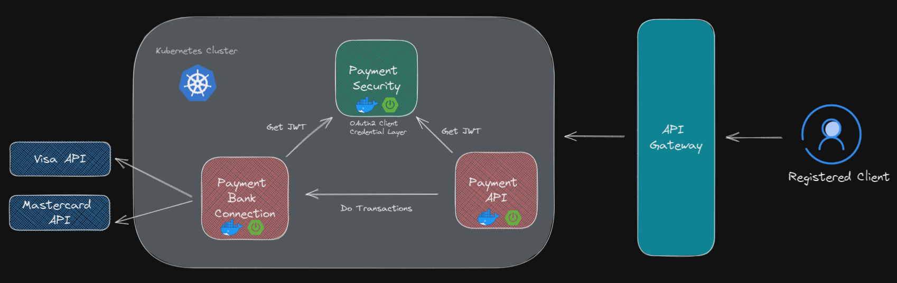

# Payment Platform API

Api layer of a payment platform, this repository is the resource server
that can be accessed only by clients registered and authorized using JWT.

This server is connected to the [Security Layer](https://github.com/aLucaz/payment-platform-security).

## Technologies and Concept used

- Oauth2 resource server
- Spring Security
    - Spring security resource server
- Client Credentials Grant Type
- Java 11
- OpenAPI 3.0 
- FeignClient
- Microservices
- Docker
- Kubernetes
- Circuit breaker
- Fallbacks

## Project achitecture



### Project structure

```
./src/main
├── java
│   └── pe
│       └── client
│           └── custom
│               └── app
│                   ├── choice
│                   ├── client
│                   │   └── fallback
│                   ├── config
│                   ├── controller
│                   ├── dto
│                   ├── service
│                   │   └── impl
│                   ├── util
│                   │   └── constant
│                   └── validation
│                       └── annotation
└── resources
    ├── static
    └── templates
```

## Project documentation

In progress

## Running


